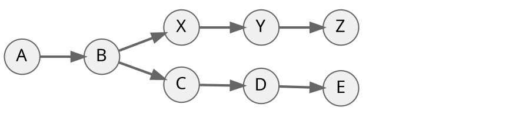
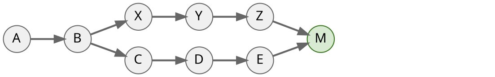
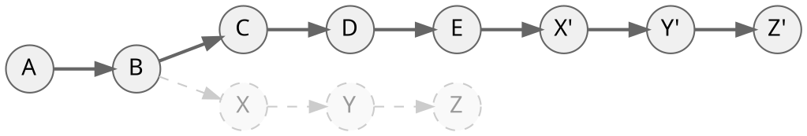

# Choosing the default behavior of `git pull`

## TL;DR

The `git pull` command offers different default behaviors. This guide clarifies the differences between these settings.
Essentially, this installer screen configures what happens when you type a plain `git pull` in your terminal. It sets a global preference so you don't have to manually type flags (like `--rebase`).

You can change your choice later with the [`git config`](#changing-your-choice-later) command.

## What does `git pull` actually do?

Behind the scenes, `git pull` is a two-step command. It first runs `git fetch` to download the latest commits from the remote, then it integrates those commits into your current branch. The three options on the installer screen only affect the second step.

### No divergence (Fast-Forward)

If you haven't made any local changes since your last pull, Git simply moves your branch pointer forward to match the remote. This is known as a fast-forward. **In a fast-forward scenario, all three installer options behave identically.**

**Before pull:**


**After `git pull` (fast-forwarded):**


### Divergence

If you have made local changes but the remote repository has also been modified, then your histories have diverged. 



## The three installer options

When histories diverge, a fast-forward is no longer possible. This is where the three installer options come into play.

### Option 1: Merge

* **Equivalent command: `git pull --no-rebase`**

Git automatically creates a new **merge commit** to combine branches. This preserves the exact timeline of parallel work.



### Option 2: Rebase

* **Equivalent command: `git pull --rebase`**

Git temporarily sets your local commits aside, updates your branch to match the remote, and rewrites your commits on top of the remote branch, keeping a single linear timeline.

**Before pull:**


**After `git pull --rebase`:**


*Note: Rebasing changes the IDs (SHAs) of your local commits.*

### Option 3: Fast-forward only

* **Equivalent command: `git pull --ff-only`**

*This is the default behavior of `git pull`.*

Git will safely abort if a fast-forward is not possible, requiring you to manually choose how to combine branches.

## How to resolve conflicts

There are many ways to resolve conflicts:
- Directly in a command-line text editor.
- Using IDE extensions.
- Using graphical interfaces like GitHub Desktop.

For a detailed guide on managing conflicts in Git for Windows, see our dedicated page:
**[Merge Conflicts - Resolving and Remembering them](./merge-conflicts-resolving-and-remembering-them.html)**

## Changing your choice later

You can change this behavior at any time without reinstalling Git by running one of the following commands:

```sh
# Option 1: Merge
git config --global pull.rebase false

# Option 2: Rebase
git config --global pull.rebase true

# Option 3: Fast-forward only (Default)
git config --global pull.ff only
```

## Related resources

- [Mapping Between Git Installer GUI Settings and Command-Line Arguments](./mapping-between-git-installer-gui-settings-and-command-line-arguments.html)
- [Silent or Unattended Installation](./silent-or-unattended-installation.html)
- Official Git documentation: [`git-pull`](https://git-scm.com/docs/git-pull)
